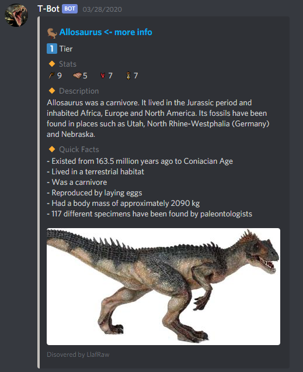
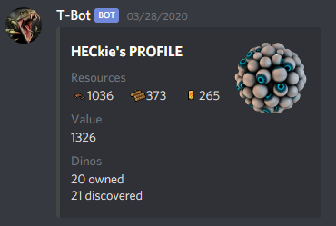
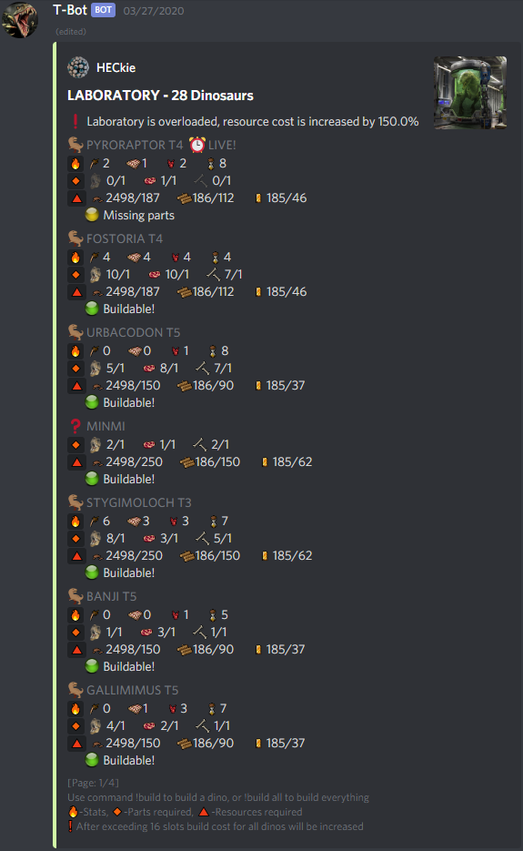
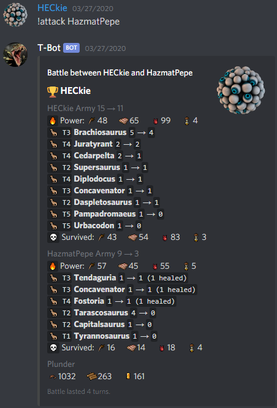
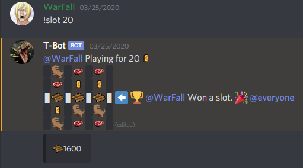

# T-Bot
Discord bot with dinosaur-based minigame

# Logic
From time to time bot creates a voice channel named by some dinosaur. When users enter the channel they are given a drop (part of a dino or entire dino). After few seconds channel disappears.
Bot rewards online members and those who are active on voice channel by passively giving resources.
Using collected parts and resources members can build dinosaurs in their lab and add them to their army.
Owned dinosaurs can be used to attack others and steal their resources.

# Run
```
$ pip install -r requirements.txt
$ python T-Bot.py
```

# Setup
```
!setvoicecat caterogry_id - sets voice category in which bot will operate
!setjnotif - sets notifications to current channel
```

# Example Commands and Features
## Drop event

## Dinosaur discovery
Shows dino's info when first discovered, there are over 1100 dinosaurs that can be added.


## Command: !profile
Shows members profile.


## Command: !lab
Shows build progress for dinos.


## Command: !attack
Lets you attack another member and plunder his resources.


## Command: !slot
The only currently implemented minigame, not balanced at all.



